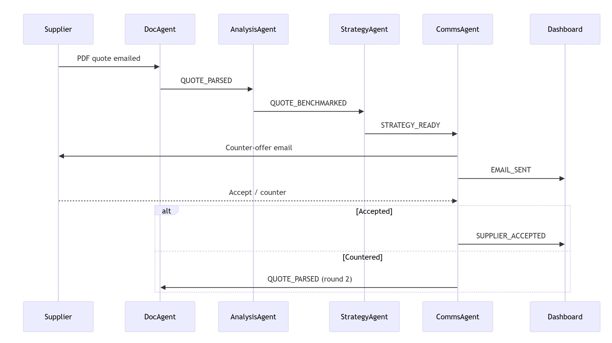
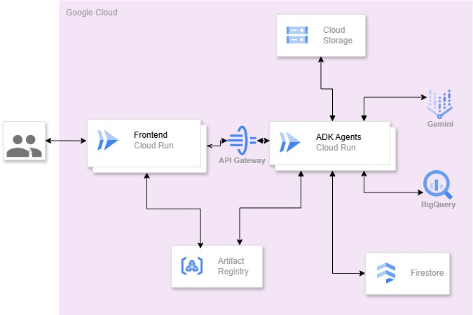

# 🛠️ Procurement Negotiation Agentic App

This project is an **AI-powered procurement negotiation platform** that simulates supplier negotiation workflows using a multi-agent architecture. It includes both a **Python-based backend** and a **Node.js/Next.js frontend**, containerized using Docker.

---

## 📦 Project Structure

```
.
├── procurement_neg_agents/           # Backend - Python agents
│   ├── main.py
│   └── requirements.txt
│   ├── api/
│   └── agents/
├── procurement_neg_frontend/        # Frontend - Next.js app
│   ├── package.json
│   └── ...
├── docs/
│   ├── flow.jpeg                     # Agentic workflow diagram
│   └── architecture.jpg              # System architecture
│   └── sample quotes.jpg            
└── README.md
```

---

## 🐍 Backend: Python Agent System

- **Language**: Python 3.10 and above
- **Entry Point**: `main.py`
- **Dependencies**: `requirements.txt`

### 🔧 Dockerfile

```dockerfile
FROM python:3.10-slim

WORKDIR /app
COPY procurement_neg_agents/requirements.txt .
RUN pip install --no-cache-dir -r requirements.txt
COPY procurement_neg_agents/ .

EXPOSE 8080 443 80

CMD ["python", "main.py"]
```

---

## ⚛️ Frontend: Negotiation UI

- **Framework**: Next.js (Node.js 20)
- **Environment Variable**: `NEXT_PUBLIC_BACKEND_API`

### 🔧 Dockerfile

```dockerfile
FROM node:20-bullseye-slim

WORKDIR /app

COPY procurement_neg_frontend/package*.json ./
RUN npm install

COPY procurement_neg_frontend/ ./

ARG NEXT_PUBLIC_BACKEND_API 
RUN echo "NEXT_PUBLIC_BACKEND_API=$NEXT_PUBLIC_BACKEND_API" > .env
RUN cat .env

RUN npm run build

EXPOSE 8080 3000
CMD ["npm", "run", "dev"]
```

---

## 📸 Documentation

- **Flow Diagram** – `docs/flow.jpeg`  
  Visualizes the multi-agent negotiation workflow.
  



- **System Architecture** – `docs/architecture.jpg`  
  Shows high-level system components and data flow.
  


- **Sample Supplier Quotes** – `docs/`  
  Contains test data from public sources (Google) used during development.

---

## 🚀 Running the App with Docker

### 🔹 Build and Run Backend

```bash
docker build -t neg-backend -f Dockerfile.backend .
docker run -p 8080:8080 neg-backend
```

### 🔹 Build and Run Frontend

Replace `<backend_url>` with the actual backend URL (e.g., `http://localhost:8080`):

```bash
docker build -t neg-frontend --build-arg NEXT_PUBLIC_BACKEND_API=<backend_url> -f Dockerfile.frontend .
docker run -p 3000:3000 neg-frontend
```

---

## Deployment
Github actions. see .github folder

---


## 📬 Contact / Contribution

If you'd like to contribute or have questions, feel free to open an issue or pull request.

---

## ✅ TODO

- [ ] Add authentication for frontend/backend
- [ ] Integrate real supplier APIs for benchmarking
- [ ] Enhance agent decision logic
- [ ] Improve UI/UX based on usability testing
